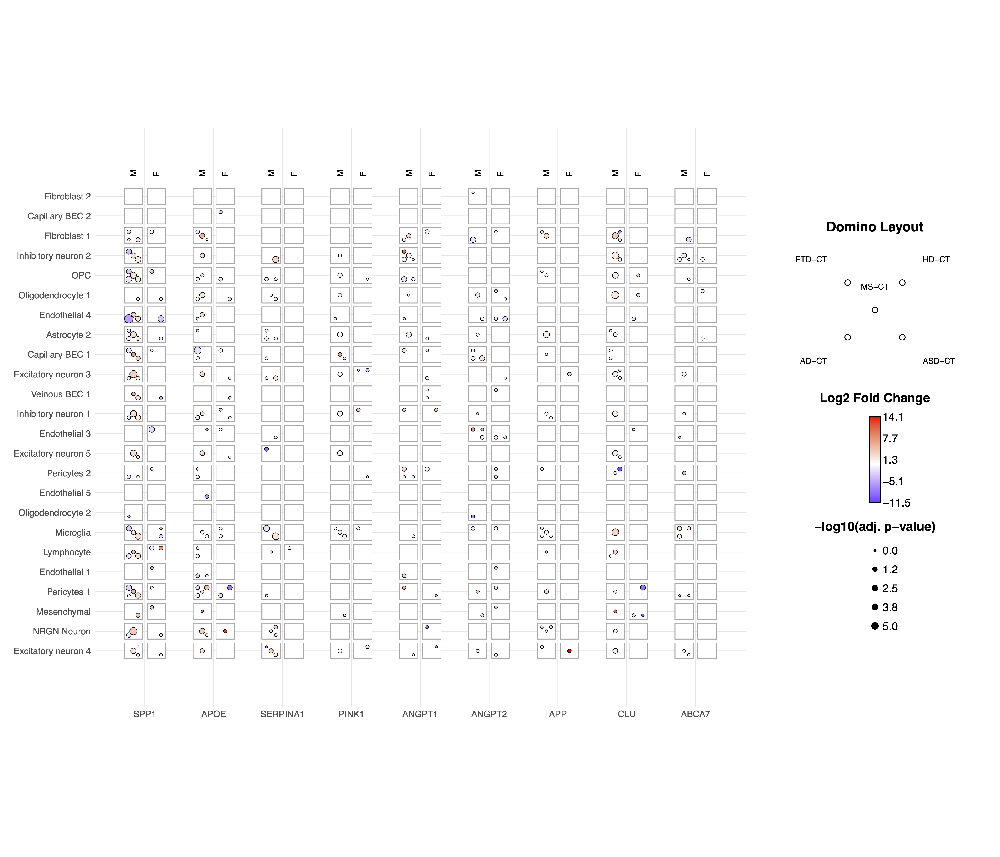

[](https://CRAN.R-project.org/package=diceplot)
[](https://CRAN.R-project.org/package=diceplot)

> [!Note]
> This repository is in active development

# DicePlot

The **DicePlot** package allows you to create visualizations (dice plots) for datasets with more than two categorical variables and additional continuous variables. This tool is particularly useful for exploring complex categorical data and their relationships with continuous variables.

## Installation

To install the **DicePlot** package, follow these steps:

### 1. Install R

Ensure that you have R installed on your system. You can download it from [The Comprehensive R Archive Network (CRAN)](https://cran.r-project.org/).
Or use conda:

```r
conda create -n diceplot -c conda-forge r-base -y
conda activate diceplot
```

### 2. Install Required Packages

The `DicePlot` package depends on several other R packages. Install them by running:

```r
install.packages(c(
    "devtools",
    "dplyr",
    "ggplot2",
    "tidyr",
    "data.table",
    "ggdendro"
))
```

### 3. Install DicePlot

You have three options for installing the DicePlot package:

#### 3.1 Install from CRAN (Recommended)
```r
install.packages("diceplot")
```

#### 3.2 Install from GitHub
```r
# Install devtools if you haven't already
install.packages("devtools")
# Install DicePlot from GitHub
devtools::install_github("maflot/DicePlot/diceplot")
```

#### 3.3 Install from Local Files
Download the repository and run the following code to install the package:
```r
install.packages("$path on your local machine$/DicePlot/diceplot", repos = NULL, type="source")
```

### 4. Load the Package

After installation, load the `DicePlot` package into your R session:

```r
library(diceplot)
```

## Example Usage: Dice Plot

Here is a simple example of how to use the `DicePlot v0.1.2` package.  
For more examples, check the tests/ folder.

```r
# Load necessary libraries
library(diceplot)
library(tidyr)
library(data.table)
library(ggplot2)
library(dplyr)
library(tibble)
library(grid)
library(cowplot)
library(RColorBrewer)
```

First, we define the cell types, pathways, pathway groups, pathology variables, and assign colors to pathology variables:

```r
# Define common variables
cell_types <- c("Neuron", "Astrocyte", "Microglia", "Oligodendrocyte", "Endothelial")
pathways <- c(
  "Apoptosis", "Inflammation", "Metabolism", "Signal Transduction", "Synaptic Transmission",
  "Cell Cycle", "DNA Repair", "Protein Synthesis", "Lipid Metabolism", "Neurotransmitter Release",
  "Oxidative Stress", "Energy Production", "Calcium Signaling", "Synaptic Plasticity", "Immune Response"
)

# Assign groups to pathways
pathway_groups <- data.frame(
  Pathway = pathways,
  Group = c(
    "Linked", "UnLinked", "Other", "Linked", "UnLinked",
    "UnLinked", "Other", "Other", "Other", "Linked",
    "Other", "Other", "Linked", "UnLinked", "Other"
  ),
  stringsAsFactors = FALSE
)

pathology_variables <- c("AD", "Cancer", "Flu", "ADHD", "Age", "Weight")

# Assign colors to pathology variables
n_colors <- length(pathology_variables)
colors <- brewer.pal(n = n_colors, name = "Set1")
z_colors <- setNames(colors, pathology_variables)
```

**Explanation:**
- **Cell Types**: A list of different cell types involved in the study.
- **Pathways**: Biological pathways relevant to the cell types.
- **Pathway Groups**: Categorization of pathways into 'Linked', 'UnLinked', or 'Other'.
- **Pathology Variables**: Medical conditions or variables of interest.
- **Colors Assignment**: Assigning a unique color to each pathology variable for visualization.

Now we finalize the data and plot the dice plot:

```r
# Create dummy data
set.seed(123)
data <- expand.grid(CellType = cell_types, Pathway = pathways, stringsAsFactors = FALSE)

data <- data %>%
  rowwise() %>%
  mutate(
    PathologyVariable = list(sample(pathology_variables, size = sample(1:length(pathology_variables), 1)))
  ) %>%
  unnest(cols = c(PathologyVariable))

# Merge the group assignments into the data
data <- data %>%
  left_join(pathway_groups, by = "Pathway")
  
# Use the dice_plot function with new parameter names
p = dice_plot(
  data = data, 
  x = "CellType", 
  y = "Pathway", 
  z = "PathologyVariable", 
  group = "Group",
  group_alpha = 0.6,
  title = "Dice Plot with 6 Pathology Variables",
  z_colors = z_colors, 
  custom_theme = theme_minimal(),
  min_dot_size = 2,
  max_dot_size = 4
)

print(p)
# Simply save the plot using the ggplot functions
# ggsave("./diceplot_example.png", p, width = 8, height = 9)
```

**Explanation:**
- **Data Creation**: We create a data frame that contains all combinations of cell types and pathways.
- **Assign Pathology Variables**: For each combination, we randomly assign one or more pathology variables.
- **Merge Groups**: We add the group information to each pathway.
- **Plotting**: We directly call dice_plot to generate and display the dice plot with the specified parameters.

### Output


## Domino Plot Tutorial

### Introduction to Domino Plots

A **Domino Plot** is a specialized visualization from the DicePlot package that allows you to display differential expression data across multiple categorical variables. It's particularly useful for visualizing how gene expression changes across different cell types, conditions, and contrasts. 

The plot uses colors to represent up/down-regulation and size to represent statistical significance. This example uses data from the [ZEBRA](https://ccb-compute.cs.uni-saarland.de/brain_atlas) database, a hierarchically integrated gene expression atlas of the murine and human brain at single-cell resolution.

### Prerequisites

Before starting, ensure you have the following packages installed:

```r
install.packages(c("dplyr", "tidyr", "ggplot2", "diceplot"))
```

### Dataset Overview

For this tutorial, we'll use a dataset derived from human cortex samples that contains differential expression analysis results comparing gene expression between sexes across various neurological conditions. The dataset includes:

- **gene**: Gene symbols
- **cell_type**: Different cell types in the brain
- **contrast**: Different disease conditions compared to control (e.g., "MS-CT" compares Multiple Sclerosis to Control)
- **sex**: The contrast variable (male vs female)
- **logFC**: Log fold change values
- **PValue** and **FDR**: Statistical significance measures

### Step 1: Load Required Libraries

```r
library(dplyr)
library(tidyr)
library(ggplot2)
library(diceplot)
```

### Step 2: Load and Prepare the Data

```r
# Load dataset
zebra.df = read.csv(file = "data/ZEBRA_sex_degs_set.csv")

genes = c("SPP1","APOE","SERPINA1","PINK1","ANGPT1","ANGPT2","APP","CLU","ABCA7")
zebra.df <- zebra.df %>% filter(gene %in% genes) %>%
  filter(contrast %in% c("MS-CT","AD-CT","ASD-CT","FTD-CT","HD-CT")) %>%
  mutate(cell_type = factor(cell_type, levels = sort(unique(cell_type)))) %>%
  filter(PValue < 0.05)
```

### Step 3: Create a Basic Domino Plot

Let's start with a basic domino plot using the default parameters:

```r
p_basic <- domino_plot(
  data = zebra.df,      # Input data
  gene_list = genes,    # List of genes to include
  var_id = "contrast",  # Variable that identifies different conditions
  x = "gene",           # Variable for x-axis
  y = "cell_type",      # Variable for y-axis
  contrast = "sex",     # Contrast variable (e.g., male vs female)
  log_fc = "logFC",     # Column name for log fold change
  p_val = "FDR"         # Column name for p-values
)

# Display the plot
print(p_basic)
```

### Step 4: Create a Customized Domino Plot

Now, let's create a more customized version with specific dot sizes and logFC limits:

```r
p_advanced <- domino_plot(
  data = zebra.df,
  gene_list = genes,
  var_id = "contrast",
  x = "gene",
  y = "cell_type",
  contrast = "sex",
  log_fc = "logFC",
  p_val = "FDR",
  min_dot_size = 1,     # Minimum dot size for least significant results
  max_dot_size = 3,     # Maximum dot size for most significant results
  logfc_limits = c(min(zebra.df$logFC)-1, max(zebra.df$logFC)-1)  # Custom logFC color scale limits
)

# Display the plot
print(p_advanced$domino_plot)
```

### Understanding the Domino Plot Output

The `domino_plot()` function returns a list with several components:

1. `domino_plot`: The main plot object
2. Other components that vary based on the version you're using

You can access the main plot using `p_advanced$domino_plot`.

### Step 5: Further Customizing the Plot

Since the domino plot returns a ggplot2 object, you can further customize it using standard ggplot2 functions:

```r
p_custom <- p_advanced$domino_plot + 
  theme_minimal() +
  theme(
    axis.text.x = element_text(angle = 45, hjust = 1),
    plot.title = element_text(hjust = 0.5, size = 14),
    legend.position = "bottom"
  ) +
  labs(title = "Differential Expression Across Cell Types and Conditions")

# Display the customized plot
print(p_custom)

# Save the plot
ggsave("domino_plot_example.png", p_custom, width = 10, height = 8, dpi = 300)
```

### Step 6: Creating a Faceted Domino Plot

You can create a faceted domino plot to separate results by a particular variable:

```r
p_faceted <- domino_plot(
  data = zebra.df,
  gene_list = genes,
  var_id = "contrast",
  x = "gene",
  y = "cell_type",
  contrast = "sex",
  log_fc = "logFC",
  p_val = "FDR",
  min_dot_size = 1,
  max_dot_size = 3
)$domino_plot +
  facet_wrap(~contrast, scales = "free_y") +
  theme(
    strip.background = element_rect(fill = "lightgray"),
    strip.text = element_text(face = "bold")
  )

# Display the faceted plot
print(p_faceted)

# Save the faceted plot
ggsave("domino_plot_faceted.png", p_faceted, width = 14, height = 10, dpi = 300)
```

### Parameter Explanation

The `domino_plot()` function has several important parameters:

| Parameter | Description |
|-----------|-------------|
| `data` | Input data frame containing all necessary variables |
| `gene_list` | List of genes to include in the plot |
| `var_id` | Variable that identifies different conditions |
| `x` | Variable for x-axis (typically genes) |
| `y` | Variable for y-axis (typically cell types) |
| `contrast` | Contrast variable (e.g., sex, treatment) |
| `log_fc` | Column name for log fold change values |
| `p_val` | Column name for p-values |
| `min_dot_size` | Minimum dot size for least significant results |
| `max_dot_size` | Maximum dot size for most significant results |
| `logfc_limits` | Custom limits for logFC color scale |

### Output

### Interpreting the Domino Plot

In a domino plot:

- **Color**: Represents the direction and magnitude of change
  - Red typically indicates upregulation (positive logFC)
  - Blue typically indicates downregulation (negative logFC)
  - The intensity of color represents the magnitude of change

- **Size**: Represents statistical significance
  - Larger dots indicate more statistically significant results (smaller p-values)
  - Smaller dots indicate less statistically significant results (larger p-values)

- **Position**: Shows the combination of categorical variables
  - x-axis: Typically genes
  - y-axis: Typically cell types
  - Facets (if used): Can represent different conditions or contrasts

## Use DicePlot in Python

For using dice plots in Python, please refer to [pyDicePlot](https://github.com/maflot/pyDicePlot/tree/main)

## Documentation

For full documentation and additional examples, please refer to the [documentation](https://dice-and-domino-plot.readthedocs.io/en/latest/index.html#)

## Features

- **Visualize Complex Data:** Easily create plots for datasets with multiple categorical variables.
- **Customization:** Customize plots with titles, labels, and themes.
- **Integration with ggplot2:** Leverages the power of `ggplot2` for advanced plotting capabilities.

## Contributing

We welcome contributions from the community! If you'd like to contribute:

1. Fork the repository on GitHub.
2. Create a new branch for your feature or bug fix.
3. Submit a pull request with a detailed description of your changes.

## Contact

If you have any questions, suggestions, or issues, please open an issue on GitHub.

## Change Log v0.1.6

- Update the examples to real world data
- move example files out of test to example

### geom_dice_sf
- add prototype for geom_dice_sf function
- see examples/geom_dice_sf_test2.R

### domino_plot function
- Add proper legend to the plot, remove intermediate plot
- Default logfc crop to NULL

## Citation

If you use this code or the R and Python packages for your own work, please cite diceplot as:
  
> M. Flotho, P. Flotho, A. Keller, "Diceplot: A package for high dimensional categorical data visualization," arxiv, 2024. [doi:10.48550/arXiv.2410.23897](https://doi.org/10.48550/arXiv.2410.23897)

BibTeX entry:
```
@article{flotea2024,
    author = {Flotho, M. and Flotho, P. and Keller, A.},
    title = {Diceplot: A package for high dimensional categorical data visualization},
    year = {2024},
    journal = {arXiv preprint},
    doi = {https://doi.org/10.48550/arXiv.2410.23897}
}
```

## References

[1] Flotho, M., Flotho, P., Keller, A. (2024). Diceplot: A package for high dimensional categorical data visualization. *arXiv preprint*. https://doi.org/10.48550/arXiv.2410.23897

[2] Flotho, M., Amand, J., Hirsch, P., Grandke, F., Wyss-Coray, T., Keller, A., Kern, F. (2023). ZEBRA: a hierarchically integrated gene expression atlas of the murine and human brain at single-cell resolution. *Nucleic Acids Research*, 52(D1), D1089-D1096. https://doi.org/10.1093/nar/gkad990