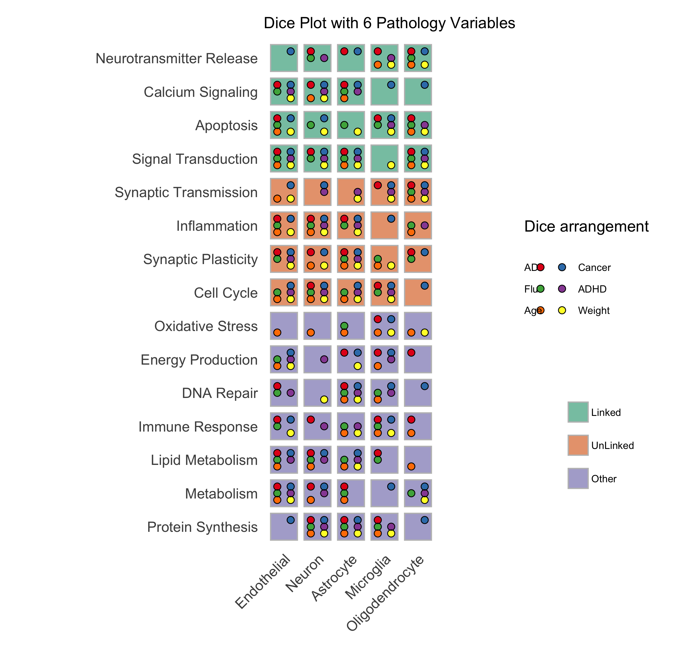

[](https://CRAN.R-project.org/package=diceplot)
[](https://CRAN.R-project.org/package=diceplot)
> [!Note]
> This repository is in active development

# Change-log v0.1.3
None yet

# DicePlot

The **DicePlot** package allows you to create visualizations (dice plots) for datasets with more than two categorical variables and additional continuous variables. This tool is particularly useful for exploring complex categorical data and their relationships with continuous variables.

## Installation

To install the **DicePlot** package, follow these steps:

### 1. Install R

Ensure that you have R installed on your system. You can download it from [The Comprehensive R Archive Network (CRAN)](https://cran.r-project.org/).
Or use conda:

```r
conda create -n diceplot -c conda-forge r-base -y
conda activate diceplot
```

### 2. Install Required Packages

The `DicePlot` package depends on several other R packages. Install them by running:

```r
install.packages(c(
    "devtools",
    "dplyr",
    "ggplot2",
    "tidyr",
    "data.table",
    "ggdendro"
))
```

### 3.1 Install DicePlot from GitHub

You can install the `DicePlot` package directly from GitHub using the `devtools` package

```r
# Install devtools if you haven't already
install.packages("devtools")
# Install DicePlot from GitHub
devtools::install_github("maflot/DicePlot/diceplot")
```
### 3.2 Install DicePlot from files
Download the repository and run following code to install the package
```r
install.packages("$path on your local machine$/DicePlot/diceplot",repos = NULL, type="source")
```

### 4. Load the Package

After installation, load the `DicePlot` package into your R session:

```r
library(diceplot)
```

## Example Usage

Here is a simple example of how to use the `DicePlot v0.1.2` package.     
For more examples check the tests/ folder.

```r
# Load necessary libraries
library(diceplot)
library(tidyr)
library(data.table)
library(ggplot2)
library(dplyr)
library(tibble)
library(grid)
library(cowplot)
library(RColorBrewer)
```
First, we define the cell types, pathways, pathway groups, pathology variables, and assign colors to pathology variables.
```r
# Define common variables
cell_types <- c("Neuron", "Astrocyte", "Microglia", "Oligodendrocyte", "Endothelial")
pathways <- c(
  "Apoptosis", "Inflammation", "Metabolism", "Signal Transduction", "Synaptic Transmission",
  "Cell Cycle", "DNA Repair", "Protein Synthesis", "Lipid Metabolism", "Neurotransmitter Release",
  "Oxidative Stress", "Energy Production", "Calcium Signaling", "Synaptic Plasticity", "Immune Response"
)

# Assign groups to pathways
pathway_groups <- data.frame(
  Pathway = pathways,
  Group = c(
    "Linked", "UnLinked", "Other", "Linked", "UnLinked",
    "UnLinked", "Other", "Other", "Other", "Linked",
    "Other", "Other", "Linked", "UnLinked", "Other"
  ),
  stringsAsFactors = FALSE
)

pathology_variables <- c("AD", "Cancer", "Flu", "ADHD", "Age", "Weight")

# Assign colors to pathology variables
n_colors <- length(pathology_variables)
colors <- brewer.pal(n = n_colors, name = "Set1")
cat_c_colors <- setNames(colors, pathology_variables)
```
Explanation:

-	Cell Types: A list of different cell types involved in the study.
-	Pathways: Biological pathways relevant to the cell types.
-	Pathway Groups: Categorization of pathways into ‘Linked’, ‘UnLinked’, or ‘Other’.
-	Pathology Variables: Medical conditions or variables of interest.
-	Colors Assignment: Assigning a unique color to each pathology variable for visualization.

Function to Create and Plot Dice Plots
Now we finalize the data and plot the diceplot

```r
# Create dummy data
set.seed(123)
data <- expand.grid(CellType = cell_types, Pathway = pathways, stringsAsFactors = FALSE)

data <- data %>%
  rowwise() %>%
  mutate(
    PathologyVariable = list(sample(pathology_variables, size = sample(1:length(pathology_variables), 1)))
  ) %>%
  unnest(cols = c(PathologyVariable))

# Function to create and plot dice plots
# Merge the group assignments into the data
data <- data %>%
  left_join(pathway_groups, by = "Pathway")
  
# Use the dice_plot function
p = dice_plot(
  data = data, 
  cat_a = "CellType", 
  cat_b = "Pathway", 
  cat_c = "PathologyVariable", 
  group = "Group",
  group_alpha = 0.6,
  title = "Dice Plot with 6 Pathology Variables",
  cat_c_colors = cat_c_colors, 
  custom_theme = theme_minimal(),
  min_dot_size = 2,
  max_dot_size = 4
)

print(p)
# simply save the plot using the ggplot functions
# ggsave("./diceplot_example.png",p)
```
Explanation:

-	Data Creation: We create a data frame that contains all combinations of cell types and pathways.
-	Assign Pathology Variables: For each combination, we randomly assign one or more pathology variables.
-	Merge Groups: We add the group information to each pathway.
-	Plotting: We directly call dice_plot to generate and display the dice plot with the specified parameters.

This code example provides a clear definition of the data and demonstrates how to create a dice plot without using a nested function.

### Output


## Use the dice plots in python
for using dice plots in python please refer to [pyDicePlot](https://github.com/maflot/pyDicePlot/tree/main)


## Documentation

For full documentation and additional examples, please refer to the [documentation](https://dice-and-domino-plot.readthedocs.io/en/latest/index.html#)

- **Visualize Complex Data:** Easily create plots for datasets with multiple categorical variables.
- **Customization:** Customize plots with titles, labels, and themes.
- **Integration with ggplot2:** Leverages the power of `ggplot2` for advanced plotting capabilities.

## Contributing

We welcome contributions from the community! If you'd like to contribute:

1. Fork the repository on GitHub.
2. Create a new branch for your feature or bug fix.
3. Submit a pull request with a detailed description of your changes.

## Contact

If you have any questions, suggestions, or issues, please open an issue on GitHub.
